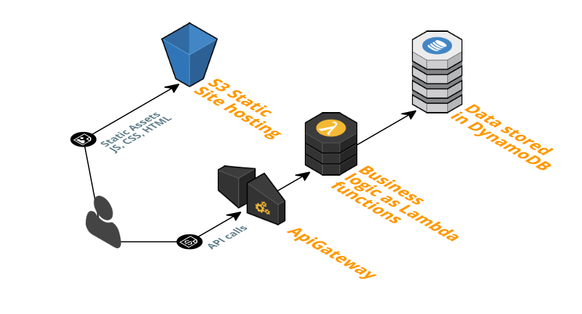

# S3 static site hosting and serverless example



## Get started

```
npm install
npm run deploy
npm run get-table-name
npm run deploy:f
```

```
cd frontend
npm run create-stack
npm install
npm run get-path-config
npm run deploy
```

# Serverless

Backend functionalities are implemented using the serverless framework and AWS Lambda functions.
Data is stored in a DynamoDB table that is also setup by serverless via CloudFormation.

## Deploy

Deploying serverless services is simple. Just run the deploy command as follows.

```
serverless deploy
```

This will setup the Lambda scripts and ApiGateway required by the http events. It will also setup a DynamoDB table,
and related IAM privileges, for storing todos.

If you only need to update the function code you can do that as well without updating the CloudFormation resources.

```
serverless deploy function -f todos
```

# Frontend

The frontend is a simple Todo application written in React.

```
cd frontend
npm install
```

## S3 static site hosting

We'll use S3 static site hosting to serve our application to the world. The frontend folder contains a CloudFormation
template called `frontend.cloudformation.yml`. This template contains the configuration that describes a bucket and
static site hosting configuration.

Create the resources with `aws` cli.

```
# in frontend folder
aws cloudformation create-stack \
	--stack-name todo-example-frontend \
	--template-body file://frontend.cloudformation.yml
```

After our stack has been created, we can upload our frontend to the bucket. But first we need the actual bucket name.
You can obtain that from the stack outputs with `aws` cli.

```
aws cloudformation describe-stacks --stack-name todo-example-frontend
```

Now we can upload our frontend to the S3 bucket with `aws` and we're all set!

```
npm run build
aws s3 sync build s3://$BUCKET
```

See [frontend/README.md](frontend/README.md) for more info.

### Get generated SDK (optional)

*This section is only left here for reference*

You can use the `aws` cli to download a generated SDK from the AWS ApiGateway service. The JavaScript SDK
however seems to be meant for the browser and would not play nice with webpack so this project uses a simple
fetch based API SDK found in `frontend/src/Api.js`.

```
aws apigateway get-rest-apis --query "items[?name == 'dev-todo-example'].id" --output text
aws apigateway get-sdk --rest-api-id $API_ID --stage-name dev --sdk-type javascript sdk.zip
unzip sdk.zip
```

# License

Copyright 2017 Nikolas Lahtinen

Permission to use, copy, modify, and/or distribute this software for any purpose with or without fee is hereby granted, provided that the above copyright notice and this permission notice appear in all copies.

THE SOFTWARE IS PROVIDED "AS IS" AND THE AUTHOR DISCLAIMS ALL WARRANTIES WITH REGARD TO THIS SOFTWARE INCLUDING ALL IMPLIED WARRANTIES OF MERCHANTABILITY AND FITNESS. IN NO EVENT SHALL THE AUTHOR BE LIABLE FOR ANY SPECIAL, DIRECT, INDIRECT, OR CONSEQUENTIAL DAMAGES OR ANY DAMAGES WHATSOEVER RESULTING FROM LOSS OF USE, DATA OR PROFITS, WHETHER IN AN ACTION OF CONTRACT, NEGLIGENCE OR OTHER TORTIOUS ACTION, ARISING OUT OF OR IN CONNECTION WITH THE USE OR PERFORMANCE OF THIS SOFTWARE.
